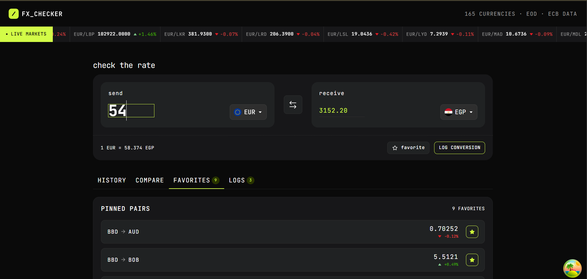
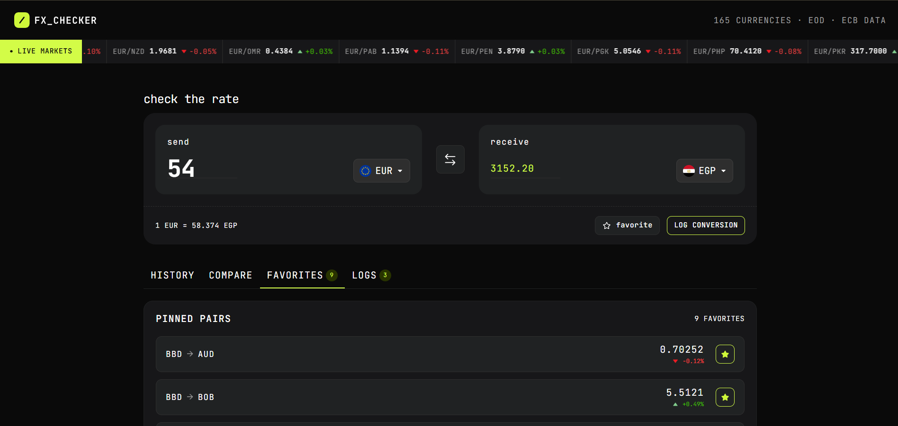
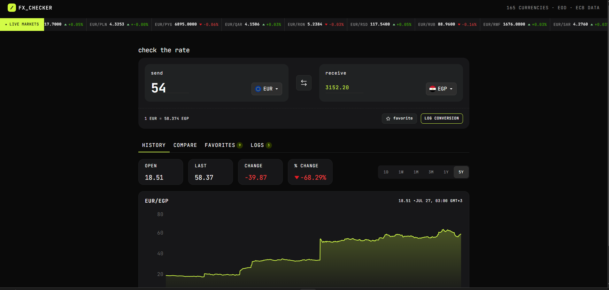
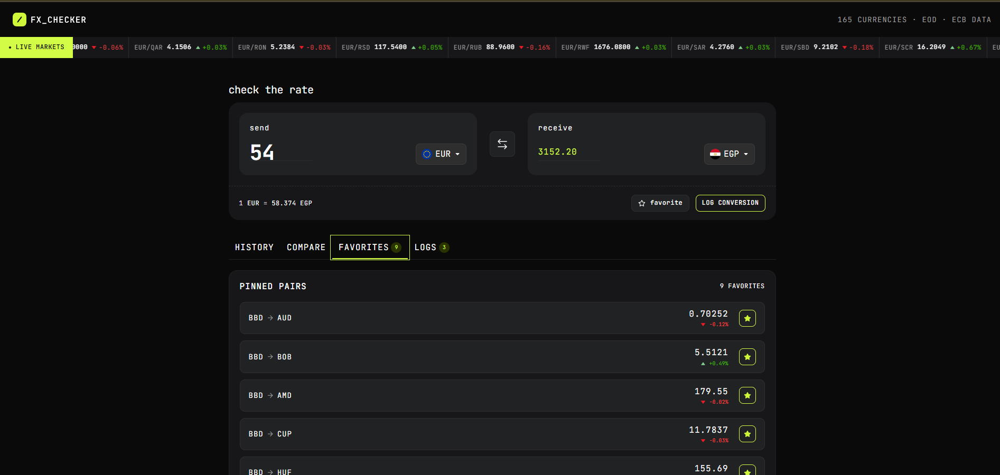
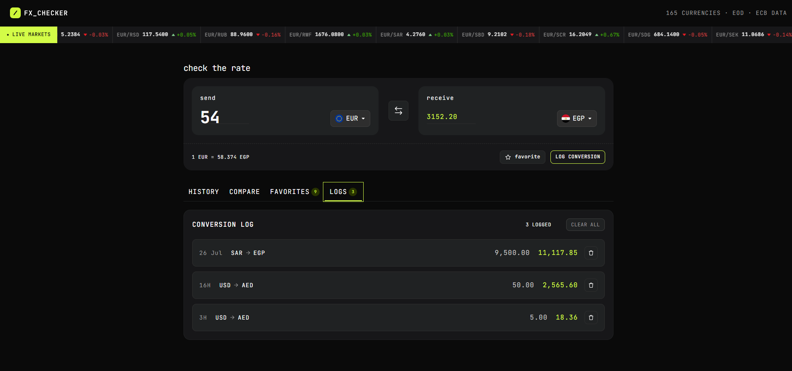
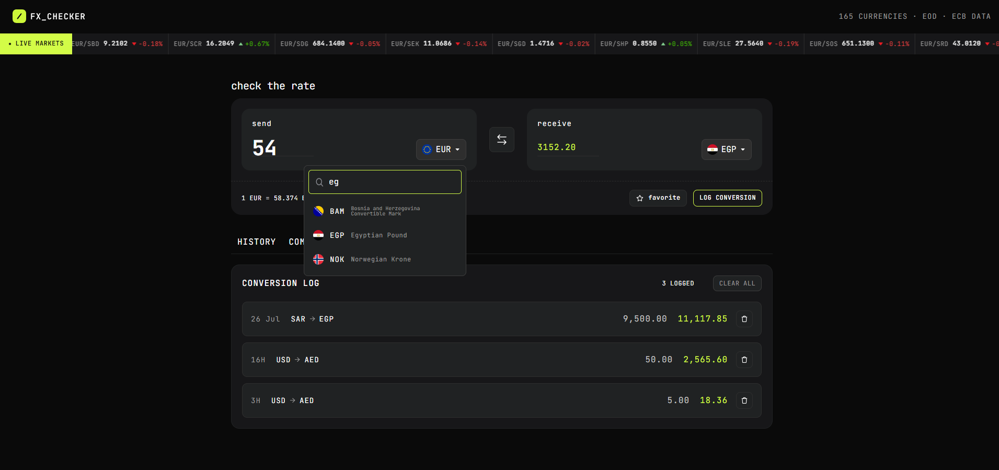

# Frontend Mentor - Foreign Exchange Currency Converter

This project is my solution to the [Foreign Exchange Currency Converter challenge on Frontend Mentor](https://www.frontendmentor.io/challenges/foreign-exchange-currency-converter). It is a responsive currency dashboard built with React and TypeScript that lets users convert currencies, inspect historical movement, compare rates, pin favorite pairs, and keep a local conversion log.

## Overview

### The Challenge

Users should be able to:

- Enter an amount and see the converted value update in real time
- Search and select both the base and quote currencies
- Swap the selected currencies instantly
- View the live rate for the active pair
- Explore historical rate data across multiple time ranges
- Compare the entered amount against several other currencies
- Pin favorite pairs and review them later
- Log conversions and remove individual entries or clear all logs
- Use the interface across desktop and mobile screen sizes

### Screenshot








### Links

- Solution URL: Add your Frontend Mentor solution link here
- Live Site URL: Add your deployed site link here

## Features

- Real-time currency conversion flow
- Searchable currency picker with flags, codes, and names
- Historical exchange-rate chart with range filters from `1D` to `5Y`
- Multi-currency comparison view
- Favorite pairs saved in local storage
- Conversion log saved in local storage
- Client-side routing for history, compare, favorites, and logs views

## Built With

- React 19
- TypeScript
- Vite
- React Router
- TanStack Query
- Styled Components
- Tailwind
- Recharts

## Getting Started

### Installation

```bash
npm install
```

### Run the Development Server

```bash
npm run dev
```

### Build for Production

```bash
npm run build
```

### Preview the Production Build

```bash
npm run preview
```

## Project Structure

```text
src/
  api/          API request helpers
  components/   Reusable UI pieces
  contexts/     Shared app state
  hooks/        Data-fetching and feature hooks
  pages/        Route-level screens
  styles/       Global styling setup
  utils/        Helpers and shared types
```

## What I Learned

This project gave me good practice combining remote data, client-side routing, and persistent UI state in a single interface. I also reinforced how useful TanStack Query is for managing loading, caching, and stale data when a UI depends on frequently changing API responses.

Another useful takeaway was structuring the app around reusable hooks and shared context. That kept the converter, compare view, favorites, and logs connected without pushing too much state into individual components.

## Continued Development

- Improve error handling and empty states across all data views
- Refine accessibility for keyboard navigation and announcements
- Add automated tests for the converter flow and saved state behavior
- Clean up naming consistency such as `Ammount` to `Amount` across the codebase

## AI Collaboration

AI was used as a coding assistant during development to help with refactoring, debugging, and polishing parts of the implementation. It was especially helpful for reviewing component structure, improving readability, and speeding up repetitive documentation and cleanup work.

## Author

- Frontend Mentor: [https://www.frontendmentor.io/profile/AbdalrahmanEsmatAdd your profile link here]
